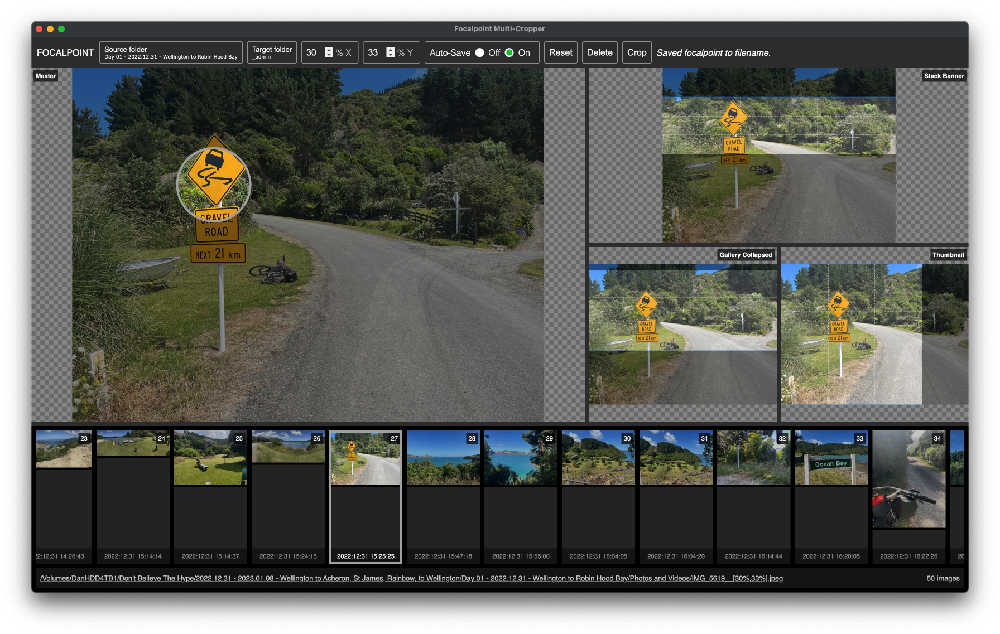

# focalpoint-multi-cropper



## Features

* **Preview** - Single window containing multiple instances of [cropperjs](https://github.com/fengyuanchen/cropperjs) - one master cropper and one or more slave croppers with user-defined `exportWidth` and `exportHeight` proportions
* **Load** - Leverage [Electron](https://www.electronjs.org/) to allow for loading of folders of images
* **Set focalpoint** - Click the master cropper image or use the number inputs to set a focalpoint, slave croppers' crop boxes will automatically follow
* **Rounding** - Initial focalpoint uses unrounded values, after a visual pause these are rounded to integers for easier storage
* **Storage** - Toggle on auto-save to write a non-default focalpoint to the image filename as a resolution-independent percentage of its width and height (integers), e.g. `foo__[40%,37%].jpg`
* **Reset** - Remove user changes and reapply the focalpoint stored in the image filename, or the defaults
* **Delete** - Delete the focalpoint and remove non-default focalpoint from the image filename
* **Resize & Crop** - Use [gm](https://github.com/aheckmann/gm) to `resizeAndCrop` from the slave croppers' crop boxes, and `resize` from the hidden non-cropper inclusions
* **Locate** - Easily open the source and target image folders to keep track of where files are
* **Embed** - Copy paths including a relative link suitable for pasting into a Markdown document or webpage
* **Restore** - Menu settings are restored when reopening the Electron app

## Usage

### Install

```js
npm install
```

### Run (Electron App)

```js
npm run start
```

### Run (Web App)

```js
npm run serve
open http://127.0.0.1:8000
```

### Lint

```js
npm run lint
```

### Test

Cypress does not have full support for Electron, so tests are run in-browser and test only non-Electron functionality.

```js
npm run test
```

### Debug

```js
// inspect the current state of crCroppersUi
document.getElementById('croppers').crCroppersUi
```

## Research

### Background

I needed a tool to art-direct thousands of images for my bicycle touring blog.

Previously I've used WordPress with Imgix. I am moving to non-subscription based systems as I no longer have the income to support these.

I will use this app to generate image URLs for the next version of my blog which runs on Vuepress.

My Vuepress app uses the following image sizes:

```js
imagesSizes: {
   type: Object,
   default: () => ({
      collapsed: {
         width: 865,
         height: 368
      },
      expanded: {
         width: 865,
      },
      panorama: {
         height: 368
      },
      thumbnail: {
         width: 320,
         height: 320
      },
   })
},
```

### Alternatives

Excluding anything that requires a subscription fee or complex serverside setup.

* <https://markerjs.com/docs/cropro/getting-started> - doesn't appear to offer preset size crops (only ratios)
* <https://github.com/fengyuanchen/cropperjs> - `cropBoxResizable` option
* <https://github.com/danfickle/bulk-image-cropper> - no overview of crop position for multiple images (one at a time)
* <https://w3codegenerator.com/code-snippets/javascript/how-to-crop-multiple-images-with-cropper-js>
* <https://pqina.nl/blog/rename-a-file-with-javascript/>
* <https://codepen.io/saleemnaufa/pen/gVewZw>
* <https://stackoverflow.com/questions/60995032/crop-and-resize-image-around-a-custom-focus-point> - crop around a crop point

### Electron

Images need to be loaded into the cropping tool. As this is best done locally to remove dependency on web-based subscription services, the app needs to be able to interact with the local file system.

The combination of `input[type="file"]` and JavaScript's [FileReader object](https://developer.mozilla.org/en-US/docs/Web/API/FileReader) only provides access to a single file.

To provide a visual overview, the cropper needs access to a folder of files.

A web browser is sandboxed for security reasons. Electron can run a web browser whilst also providing access to the operating system.

* [What is the difference between IPC send / on and invoke / handle in electron?](https://stackoverflow.com/questions/59889729/what-is-the-difference-between-ipc-send-on-and-invoke-handle-in-electron) - invoke vs send/on
* [Inter-Process Communication](https://www.electronjs.org/docs/latest/tutorial/ipc) - send/on
